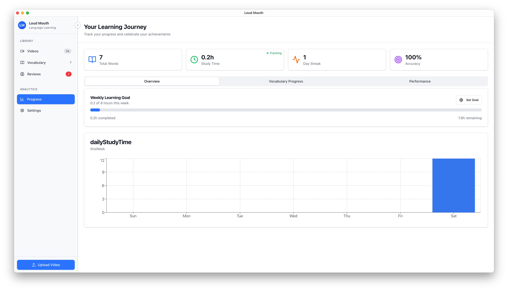

<div align="center">
  <h1>Loud Mouth</h1>
</div>
<p align="center">
  <p align="center">
    
  </p>
</p>
<div align="center">Made with ❤️ for language learners</div>
<hr />

A desktop language learning application that helps you learn vocabulary from video content using scientifically-proven spaced repetition techniques. Combine entertainment with effective language learning by extracting vocabulary from videos with dual-language subtitles.

## Features

### Video-Based Learning
- Upload and manage your video library with dual-language subtitles
- Click on any subtitle word to instantly extract vocabulary
- Context-aware learning with sentence examples from actual content

<!-- TODO: Add screenshot of video player -->


### Spaced Repetition System
- Review vocabulary using the Ebbinghaus forgetting curve algorithm
- Optimized review schedule: Day 0, 1, 3, 7, 14, 30
- Smart tracking of your learning progress

<!-- TODO: Add screenshot of review interface -->


### Progress Tracking
- Comprehensive analytics dashboard
- Monitor your learning journey over time
- Track vocabulary acquisition and retention rates

<!-- TODO: Add screenshot of progress dashboard -->


## Prerequisites

Before you begin, ensure you have the following installed:

- **Node.js** (v18 or higher) - [Download](https://nodejs.org/)
- **pnpm** (v8 or higher) - Install with `npm install -g pnpm`
- **Rust** (latest stable) - [Install via rustup](https://rustup.rs/)
- **Tauri Prerequisites** - Follow the [Tauri prerequisites guide](https://tauri.app/v1/guides/getting-started/prerequisites) for your operating system

## Installation

1. **Clone the repository:**
   ```bash
   git clone https://github.com/meatballG1210/loud-mouth-tauri.git
   cd loud-mouth-tauri
   ```

2. **Install frontend dependencies:**
   ```bash
   pnpm install
   ```

3. **Configure environment variables:**

   Copy the `.env.example` file to create your own `.env` file:
   ```bash
   cp .env.example .env
   ```

   Then edit `.env` and add your API keys:

   **Required:**
   - `VITE_OPENAI_API_KEY` - Your OpenAI API key for translation and vocabulary features
     - Get your API key from [OpenAI Platform](https://platform.openai.com/api-keys)
     - The app uses OpenAI's API for automatic translations and intelligent vocabulary extraction

   **Important:** Never commit your `.env` file to version control. It's already included in `.gitignore`.

4. **Set up the database:**

   The SQLite database will be automatically initialized on first run. Database migrations are handled by Diesel and will run automatically.

## Getting Started

### Development Mode

Run the application in development mode with hot-reload:

```bash
pnpm tauri dev
```

This will:
- Start the Vite development server
- Launch the Tauri application
- Enable hot-reload for both frontend and backend changes

### Production Build

Build the application for production:

```bash
pnpm tauri build
```

The built application will be available in `src-tauri/target/release/bundle/`

## How to Use

### 1. Adding Videos

1. Click the "Add Video" button on the home screen
2. Select a video file with embedded subtitles (supported formats: MP4, AVI, MKV, MOV)
3. The app will automatically:
   - Extract embedded subtitle streams from your video
   - Detect English and Chinese subtitles
   - Generate thumbnails
   - Process the video metadata

**Recommended Video Specifications:**
- **Video Codec:** H.264/AVC High 10 (10-bit), 1080p, 23.98 fps
- **Audio Codec:** AAC, 48 kHz, stereo
- **Subtitles:** mov_text / tx3g (two tracks: Chinese `zho` and English `eng`)
- **Container Format:** MP4, MKV, MOV, or AVI
- **Maximum File Size:** 4GB

**Important Notes:**
- Your video must have **embedded subtitle streams** (not separate subtitle files)
- Both English and Chinese subtitle streams should be embedded in the same video file
- Subtitle streams must be properly tagged with language codes (`eng` for English, `zho`/`chi`/`zh` for Chinese)
- Supported embedded subtitle formats: mov_text, tx3g, SRT, ASS, SSA, and other formats supported by FFmpeg
- The app automatically converts extracted subtitles to WebVTT format for internal use
- In order to disable local subtitles on macOS, please refer to [this](https://liyuan.org/posts/projects/how-to-hide-local-subtitles-on-macos/)

### 2. Learning from Videos

1. Select a video from your library
2. Watch the video with dual subtitles displayed
3. Click on any word in the subtitles to add it to your vocabulary
4. The app automatically captures:
   - The word and its translation
   - The sentence context
   - A timestamp for review

### 3. Reviewing Vocabulary

1. Navigate to the "Review" section
2. The app shows you words due for review based on spaced repetition
3. For each word:
   - Try to recall the meaning
   - Reveal the answer
   - Mark whether you remembered correctly
4. The app automatically schedules the next review

### 4. Tracking Progress

Visit the "Progress" page to:
- View your learning statistics
- See vocabulary growth over time
- Track review completion rates
- Identify areas for improvement

## Development

### Frontend Development

```bash
# Run Vite dev server only
pnpm dev

# Type checking
pnpm tsc

# Build frontend
pnpm build
```

### Backend Development

```bash
# Run Rust tests
cd src-tauri
cargo test

# Run Rust checks
cargo check

# Create a new database migration
diesel migration generate migration_name
```


## Contributing

Contributions are welcome! Please feel free to submit a Pull Request.

## License

This project is licensed under the MIT License - see the [LICENSE](LICENSE) file for details.
